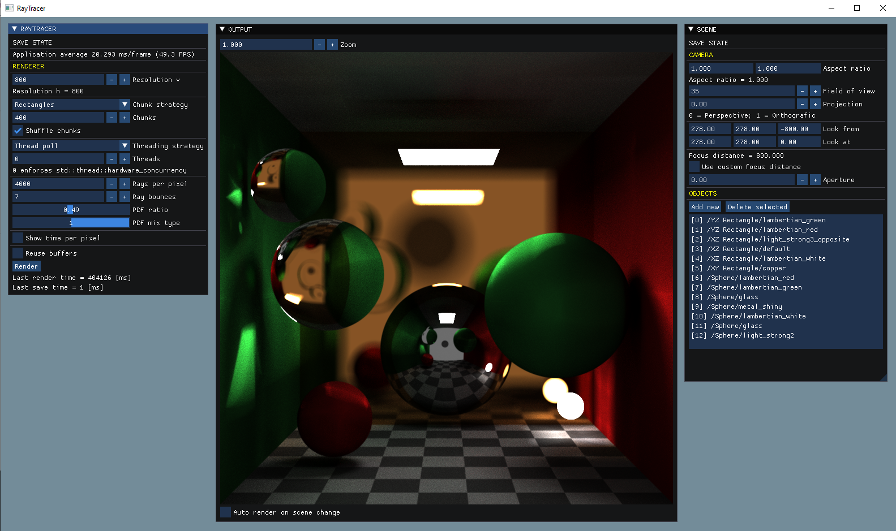

# RayTracer
**CPU Path Tracer (in a Kajiya sense)**

Author: [planet620]

Based on books: [Ray Tracing in One Weekend] by Peter Shirley

### Features
- Editor UI
    - Scene setup: spawn/delete/move/edit object properties
    - Render parameters
    - Settings
    - Real time output update
    - Save output to BMP file
- Renderer variables
    - Resolution
    - Multithreading: thread poll, PLL, none
	- SIMD
    - Work distribution: stripes, chunks
    - Rays per pixel, ray bounces
	- Anti aliasing
- Renderer camera
    - Projections: Perspective/orthografic/blend
    - Focus distance
    - Aperture
    - Aspect ratio
- Specular, diffuse, emissive materials:
    - Metal: copper, gold, silver, steel
    - Dialectric: glass, sapphire, moissanite, diamond, water
    - Texture: solid, checker
    - Lambertian: basic colors
    - Diffuse light: a few strength types
- Primitives: 
    -  Sphere
    -  XY rectangle
    -  XZ rectangle
    -  ZY rectangle

### Build details
Project file: Visual Studio 2022

Windows SDK: 10.0

Toolset: v143

### Third party dependencies
DirectX 11

[ocornut/imgui] v1.87

[nlohmann/json] 3.10.5

[PIX for Windows] 1.0.220124001

[//]: # (links)

   [planet620]: <https://mpolaczyk.pl>
   [ocornut/imgui]: <https://github.com/ocornut/imgui>
   [nlohmann/json]: <https://github.com/nlohmann/json>
   [PIX for Windows]: <https://devblogs.microsoft.com/pix/download>
   [Ray Tracing in One Weekend]: <https://raytracing.github.io>