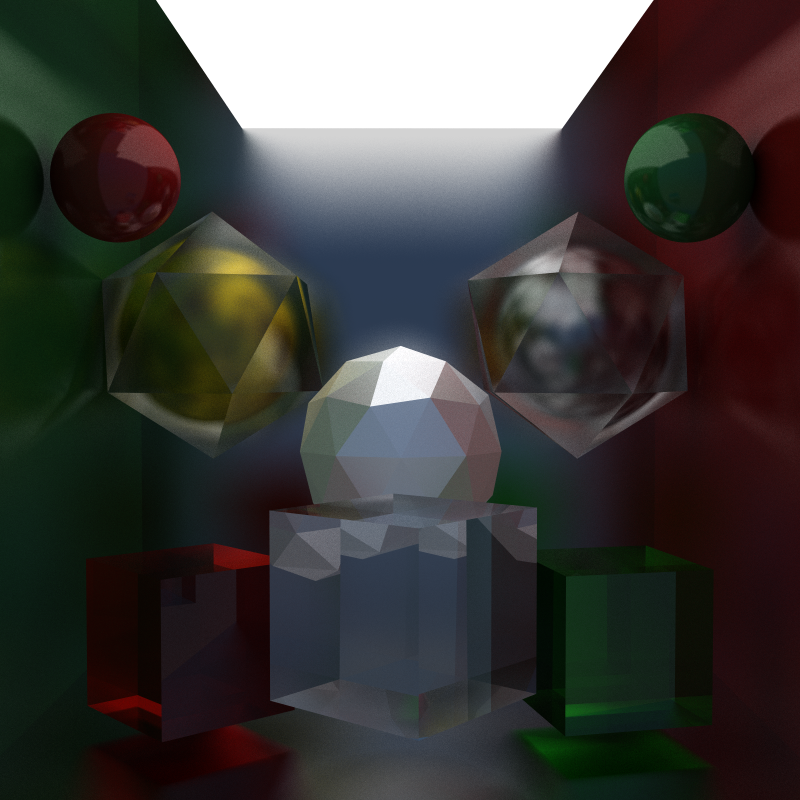
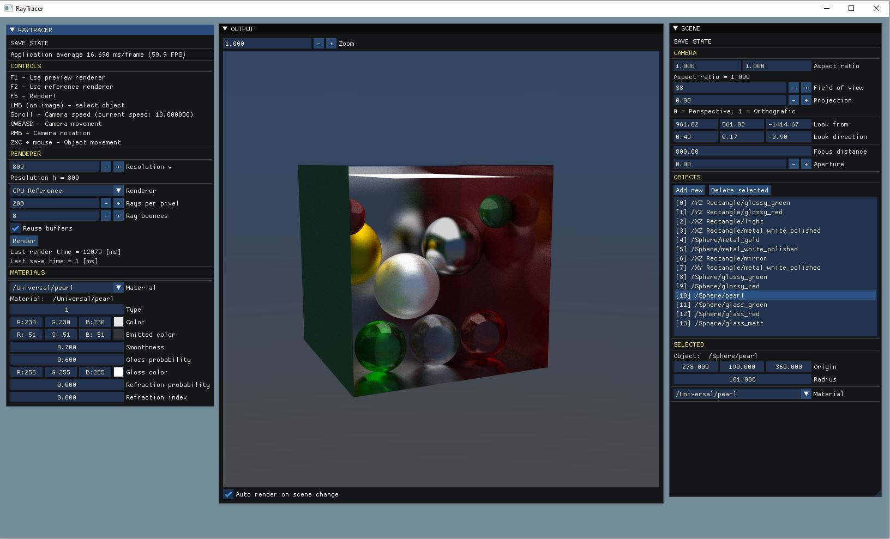
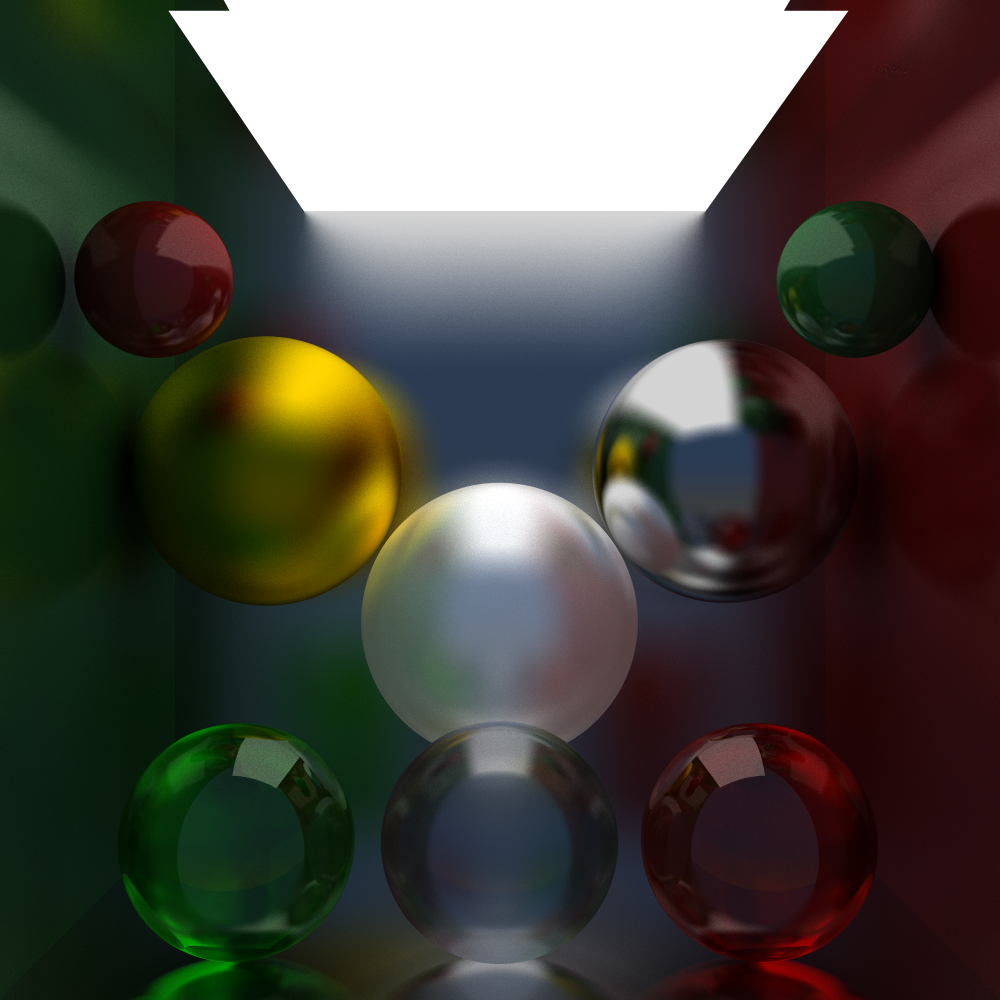
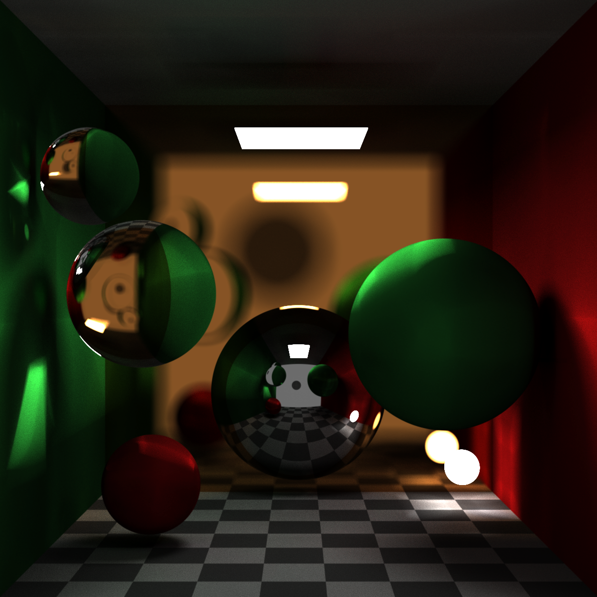

## RayTracer
**CPU and GPU Ray Tracer**

Author: [planet620]

## Releases

### [Development - GPU Renderer]
- New GPU-based reference renderer using DirectX 11 compute shaders
    - Ports the CPU ray tracing logic to run on the GPU
    - Uses DirectX 11 compute shaders for parallel processing
    - Supports scene data upload (spheres, materials, camera)
    - Iterative ray tracing implementation (converted from recursive)
    - PCG-based random number generation on GPU
    - Same visual output as CPU reference renderer with GPU acceleration
    - Thread-safe implementation compatible with async_renderer_base
- Added camera data export methods for GPU compatibility

### [2.3]
- Cornell box scene finalized
- Static mesh rendering
    - Backface detection for transparency
    - No acceleration structude ofr triangles yet
    - No static mesh assets yet
- ISPC integrated with the project and used for basic 
- Better compile times 
- CppCheck and BuildInsights pass
- Huge code refactor
- Better logging with spdlog

### [2.2]
- Full scene editor
    - Flying camera
    - Object selection and movement
    - Material editor

### [2.1]
- The same set of materials and primitives
- Renderer interface, with example and reference CPU renderer, easy to hot-swap with another version
- Simpler algorithm, no PDF in use
- Refraction with smoothness
- Coloured refraction
- Gloss with smoothness

### [1.0]
Based on books: [Ray Tracing in One Weekend] by Peter Shirley

- Editor UI
    - Scene setup: spawn/delete/move/edit object properties
    - Render parameters
    - Settings
    - Real time output update
    - Save output to BMP file
- Renderer
	- Monte Carlo based method, mix of light and surface cosine based probability density functions (PDF)
	- Multiple renderer implementations:
	    - **Reference CPU**: Full path tracing on CPU with PPL parallelization
	    - **GPU Reference (DirectX 11)**: GPU-accelerated path tracing using compute shaders
	    - **Preview**: Fast preview renderer for editing
	    - **ISPC**: Intel SPMD Program Compiler version (example only)
	- Multithreading: thread poll, PLL, none
	- Support for SIMD
    - DirectX 11 based display
	- Anti aliasing
	- No denoising
    - Starting code for the review: frame_renderer::render() and frame_renderer::ray_color()
- Renderer variables
    - Resolution
    - Work distribution: stripes, chunks
    - Rays per pixel, ray bounces
- Camera setup
    - Projections: Perspective/orthografic/blend
    - Focus distance
    - Aperture
    - Aspect ratio
- Specular, diffuse, emissive materials:
    - Metal: copper, gold, silver, steel
    - Dialectric: glass, sapphire, moissanite, diamond, water
    - Texture: solid, checker
    - Lambertian: basic colors
    - Diffuse light: a few strength types
- Primitives: 
    -  Sphere
    -  XY rectangle
    -  XZ rectangle
    -  ZY rectangle

### Build details
Project file: Visual Studio 2022

Windows SDK: 10.0

Toolset: v143

Language standard: ISO C++20

### Third party dependencies
DirectX 11

[ocornut/imgui] v1.87

[nlohmann/json] v3.10.5

[PIX for Windows] v1.0.220124001

[STB Image] v2.27

[Tiny obj] v1.0.6

[spdlog] v1.x

[ispc] v1.19.0

[//]: # (links)

   [planet620]: <https://mpolaczyk.pl>
   [1.0]: <https://bitbucket.org/planet620/raytracer/commits/tag/release_1.0>
   [2.0]: <https://bitbucket.org/planet620/raytracer/commits/tag/release_2.0>
   [2.1]: <https://bitbucket.org/planet620/raytracer/commits/tag/release_2.1>
   [2.2]: <https://bitbucket.org/planet620/raytracer/commits/tag/release_2.2>
   [2.3]: <https://bitbucket.org/planet620/raytracer/commits/tag/release_2.3>
   [ocornut/imgui]: <https://github.com/ocornut/imgui>
   [nlohmann/json]: <https://github.com/nlohmann/json>
   [PIX for Windows]: <https://devblogs.microsoft.com/pix/download>
   [STB Image]: <http://nothings.org/stb>
   [Tiny obj]: <https://github.com/tinyobjloader/tinyobjloader>
   [spdlog]: <https://github.com/gabime/spdlog/tree/v1.x>
   [ispc]: <https://ispc.github.io/>
   [Ray Tracing in One Weekend]: <https://raytracing.github.io>